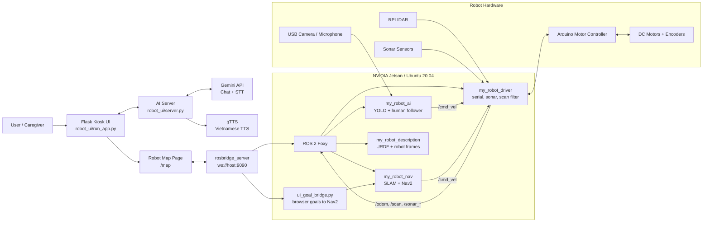
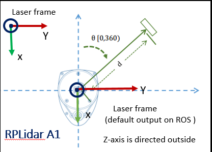
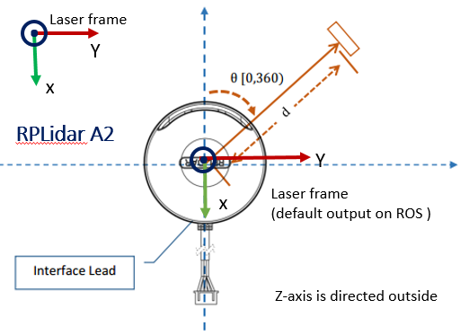

<p align="center">
  
</p>

<p align="center">
  
  
  
  
  
</p>

<p align="center">
  
</p>

## Overview

**Mopero** is a prototype care-assistant robot built around **NVIDIA Jetson + ROS 2 Foxy**. It combines motor control, lidar navigation, sonar safety sensing, camera perception, human-following behavior, and a Flask kiosk interface with a Vietnamese AI voice assistant.

> This project is designed for real-robot experimentation. Hardware ports, model paths, map files, and startup scripts may need to be adjusted for your own Jetson setup.

## Highlights

| Module | What it does |
| --- | --- |
|  | Coordinates robot drivers, navigation, perception, and transforms |
|  | Receives velocity commands and controls the differential-drive motors |
|  | Handles camera-based perception and visual processing |
|  | Provides the kiosk UI and AI assistant endpoints |
|  | Runs ROS 2, AI workloads, and the local user interface |

Core capabilities:

- Differential-drive control through `/cmd_vel`.
- ROS 2 serial bridge for Arduino motor control.
- Encoder odometry publishing on `/odom`.
- RPLIDAR scan publishing and filtering.
- Sonar range publishing for left, center, and right sensors.
- SLAM and Nav2 launch files for mapping and navigation.
- USB camera publishing through `v4l2_camera`.
- YOLO-based person detection and human-following behavior.
- Flask UI on port `5000`.
- Browser map UI for robot pose, initial pose, and navigation goals.
- `rosbridge_server` WebSocket integration on port `9090`.
- AI server on port `5001` with chat, STT, and TTS endpoints.

## System Architecture



## Hardware Preview

The repository includes RPLIDAR reference images from the lidar package:

<p align="center">
  
  
</p>

Expected hardware setup:

| Component | Role |
| --- | --- |
| NVIDIA Jetson | Main compute unit for ROS 2, UI, and AI workloads |
| Arduino motor controller | Receives serial commands and controls the motors |
| DC motors + encoders | Differential-drive movement and odometry feedback |
| RPLIDAR | Laser scan input for mapping and navigation |
| Sonar sensors | Short-range safety sensing |
| USB camera + microphone | Vision input and voice interaction |
| Battery and regulators | Power distribution for robot electronics |

Important robot parameters:

| Parameter | Value |
| --- | --- |
| Wheel radius | `0.085 m` |
| Wheel base | `0.3846 m` |
| Max motor speed | `23 RPM` |
| Base frame | `base_footprint` |
| Odom frame | `odom` |
| Map frame | `map` |

## Repository Structure

```text
.
+-- README.md
+-- robot_ui/
|   +-- app/
|   |   +-- __init__.py
|   |   +-- admin.py
|   |   +-- routes.py
|   +-- robot_launcher/
|   |   +-- start_robot_stack.sh
|   |   +-- install_robot_stack_service.sh
|   +-- static/
|   +-- templates/
|   |   +-- index.html
|   |   +-- map.html
|   +-- .env.example
|   +-- run_app.py
|   +-- server.py
|   +-- start_ui.sh
+-- ros2_ws/
    +-- arduino/
    |   +-- motor_controller/
    |       +-- motor_controller.ino
    +-- install_udev_rules.sh
    +-- stop_robot_stack.sh
    +-- src/
        +-- my_robot_ai/
        +-- my_robot_description/
        +-- my_robot_driver/
        +-- my_robot_nav/
        |   +-- scripts/
        |       +-- ui_goal_bridge.py
        +-- sllidar_ros2/
```

## Prerequisites

Recommended environment:

- Ubuntu 20.04.
- ROS 2 Foxy.
- Python 3.8.
- `colcon`.
- Arduino IDE or CLI for uploading `motor_controller.ino`.
- Gemini API key for AI chat and STT features.

Install common ROS 2 packages:

```bash
sudo apt update
sudo apt install -y \
  python3-colcon-common-extensions \
  ros-foxy-v4l2-camera \
  ros-foxy-slam-toolbox \
  ros-foxy-navigation2 \
  ros-foxy-nav2-bringup \
  ros-foxy-rosbridge-server \
  ros-foxy-robot-state-publisher \
  ros-foxy-joint-state-publisher \
  ros-foxy-rviz2
```

Install Python packages used by the UI and AI components:

```bash
python3 -m pip install --upgrade pip
python3 -m pip install flask gTTS ultralytics opencv-python numpy pyserial
```

Depending on your Jetson image, you may also need camera, TensorRT, or `cv_bridge` packages that match your ROS 2 and JetPack installation.

## Installation

### 1. Clone the repository

```bash
git clone https://github.com/namdaza/mopero.git
cd mopero
```

### 2. Build the ROS 2 workspace

```bash
source /opt/ros/foxy/setup.bash
cd ros2_ws
colcon build --symlink-install
source install/setup.bash
```

Optional shell setup:

```bash
echo "source /opt/ros/foxy/setup.bash" >> ~/.bashrc
echo "source ~/mopero/ros2_ws/install/setup.bash" >> ~/.bashrc
```

### 3. Configure USB device names

```bash
cd ~/mopero/ros2_ws
sudo ./install_udev_rules.sh
sudo udevadm control --reload-rules
sudo udevadm trigger
```

Reconnect the devices, then check:

```bash
ls -l /dev/lidar /dev/arduino_motor /dev/arduino_sonar
```

### 4. Upload Arduino firmware

Open or upload:

```text
ros2_ws/arduino/motor_controller/motor_controller.ino
```

The ROS 2 serial bridge expects the controller to accept velocity commands and return encoder data.

### 5. Configure the UI and AI server

```bash
cd ~/mopero/robot_ui
cp .env.example .env
nano .env
```

Example:

```text
API_KEY=your_real_gemini_api_key
AI_MODEL=gemini-2.5-flash
UI_ADMIN_PASSWORD=your_ui_admin_password
ADMIN_EXIT_PASSWORD=your_kiosk_exit_password
PORT=5000
AI_PORT=5001
```

Do not commit the real `.env` file.

## Usage

Open a new terminal for each major process unless you are using the launcher script.

### Full robot stack

The main launcher starts the ROS navigation stack, rosbridge, the UI goal bridge, the AI server, and the browser UI.

```bash
cd ~/mopero/robot_ui/robot_launcher
bash ./start_robot_stack.sh
```

Open the main UI:

```text
http://localhost:5000/
```

Open the robot map page:

```text
http://localhost:5000/map
```

Stop the robot stack:

```bash
cd ~/mopero/ros2_ws
bash ./stop_robot_stack.sh
```

### Robot driver

```bash
cd ~/mopero/ros2_ws
source /opt/ros/foxy/setup.bash
source install/setup.bash
ros2 launch my_robot_driver robot_driver.launch.py serial_port:=/dev/arduino_motor
```

### Camera

```bash
cd ~/mopero/ros2_ws
source install/setup.bash
ros2 launch my_robot_driver camera.launch.py video_device:=/dev/video0
```

### Sonar

```bash
cd ~/mopero/ros2_ws
source install/setup.bash
ros2 launch my_robot_driver sonar.launch.py sonar_port:=/dev/arduino_sonar
```

### Mapping

```bash
cd ~/mopero/ros2_ws
source install/setup.bash
ros2 launch my_robot_nav mapping.launch.py \
  lidar_port:=/dev/lidar \
  serial_port:=/dev/arduino_motor \
  sonar_port:=/dev/arduino_sonar
```

Save a map:

```bash
ros2 run nav2_map_server map_saver_cli -f ~/mopero/ros2_ws/src/my_robot_nav/maps/my_room_map
```

### Navigation

```bash
cd ~/mopero/ros2_ws
source install/setup.bash
ros2 launch my_robot_nav navigation.launch.py \
  lidar_port:=/dev/lidar \
  serial_port:=/dev/arduino_motor \
  sonar_port:=/dev/arduino_sonar
```

### Human following

```bash
cd ~/mopero/ros2_ws
source install/setup.bash
ros2 launch my_robot_ai human_following.launch.py serial_port:=/dev/arduino_motor
```

The YOLO node may require a TensorRT engine or model path that matches your Jetson setup.

### Flask UI

```bash
cd ~/mopero/robot_ui
python3 run_app.py
```

Open:

```text
http://localhost:5000
```

### AI server

```bash
cd ~/mopero/robot_ui
AI_PORT=5001 python3 server.py
```

Test chat:

```bash
curl -sS http://127.0.0.1:5001/chat \
  -H "Content-Type: application/json" \
  -d '{"message":"Xin chao"}'
```

### Kiosk launcher

Some launcher scripts are written for a Jetson user layout under `/home/jetson`. If your repository is located at `~/mopero`, either copy/symlink `robot_ui` to `/home/jetson/robot_ui` or update the paths in the scripts.

```bash
bash ~/mopero/robot_ui/robot_launcher/start_robot_stack.sh
```

## Robot Map UI

The map page connects to `rosbridge_server`, subscribes to the ROS map and robot pose, and publishes initial pose or navigation goal commands.

| UI action | ROS behavior |
| --- | --- |
| Open `/map` | Connects to `ws://<jetson-ip>:9090` |
| Set initial pose | Publishes localization pose for AMCL |
| Send nav goal | Sends a navigation goal through the UI bridge |
| Monitor robot | Displays map and robot pose in the browser |

Useful checks:

```bash
ss -lntp | grep 5000
ss -lntp | grep 9090
ros2 action list | grep -E 'navigate|follow|compute'
```

## Main ROS 2 Topics

| Topic | Message Type | Description |
| --- | --- | --- |
| `/cmd_vel` | `geometry_msgs/Twist` | Velocity command for the robot |
| `/odom` | `nav_msgs/Odometry` | Encoder-based odometry |
| `/tf` | `tf2_msgs/TFMessage` | Robot transforms |
| `/scan_raw` | `sensor_msgs/LaserScan` | Raw lidar scan |
| `/scan` | `sensor_msgs/LaserScan` | Filtered scan for navigation |
| `/image_raw` | `sensor_msgs/Image` | Camera stream |
| `/yolo/detections` | `std_msgs/String` | YOLO detection output |
| `/yolo/debug_image` | `sensor_msgs/Image` | Annotated debug image |
| `/sonar_left` | `sensor_msgs/Range` | Left sonar |
| `/sonar_center` | `sensor_msgs/Range` | Center sonar |
| `/sonar_right` | `sensor_msgs/Range` | Right sonar |

## Environment Variables

| Variable | Description |
| --- | --- |
| `API_KEY` | Gemini API key used by the AI server |
| `AI_MODEL` | Gemini model name |
| `UI_ADMIN_PASSWORD` | Password for UI admin controls |
| `ADMIN_EXIT_PASSWORD` | Password for exiting kiosk mode |
| `PORT` | Flask UI port, default `5000` |
| `AI_PORT` | AI server port, default `5001` |

## Troubleshooting

Check USB devices:

```bash
ls -l /dev/lidar /dev/arduino_motor /dev/arduino_sonar
ls /dev/ttyUSB* /dev/ttyACM*
```

Check ROS 2 topics:

```bash
ros2 topic list
ros2 topic echo /cmd_vel
ros2 topic echo /odom
ros2 topic echo /scan
```

Check transforms:

```bash
ros2 run tf2_tools view_frames.py
```

Check the AI server:

```bash
ps aux | grep server.py | grep -v grep
tail -n 100 /tmp/robot_ai_server.log
```

If the browser cannot access the microphone in kiosk mode, check the default PulseAudio source and the browser permission settings used in `robot_ui/start_ui.sh`.

## Notes

- Keep `.env`, build artifacts, logs, model engines, and large binary files out of Git.
- Review `package.xml` metadata before using the project as a formal release.
- Test robot motion with wheels lifted first, especially after changing serial ports, wheel parameters, or motor wiring.

<p align="center">
  
</p>
